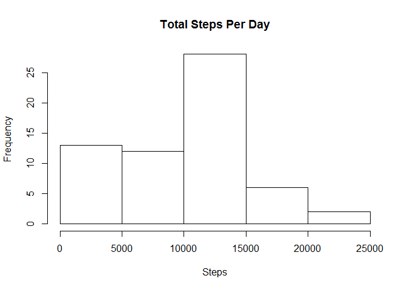
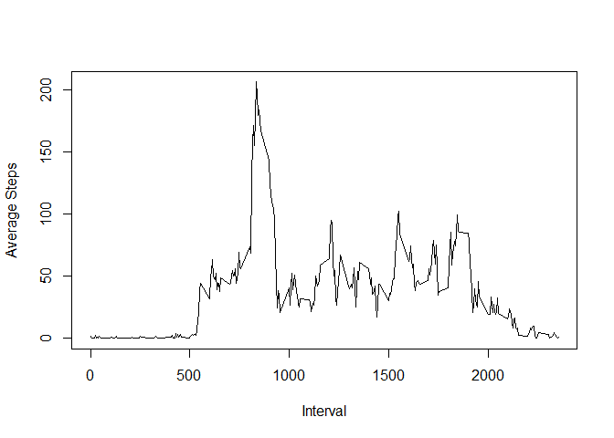
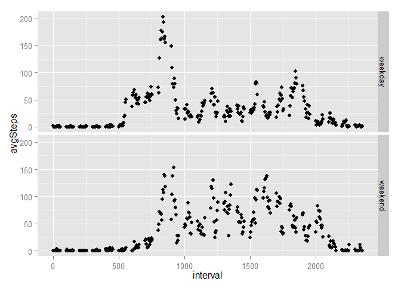

# Reproducible Research: Peer Assessment 1


## Loading and preprocessing the data

```r
setwd("C:\\raneykat_git\\ReproducibleResearch\\RepData_PeerAssessment1")
unzip("activity.zip")
dat <- read.csv("activity.csv")
```

## What is mean total number of steps taken per day?

```r
library(dplyr)
```

```
## 
## Attaching package: 'dplyr'
## 
## The following object is masked from 'package:stats':
## 
##     filter
## 
## The following objects are masked from 'package:base':
## 
##     intersect, setdiff, setequal, union
```

```r
dat2 <- dat %>%
  group_by(date) %>%
  summarize(ttlSteps = sum(steps,na.rm = TRUE))
hist(dat2$ttlSteps, xlab = "Steps", main = "Total Steps Per Day")
```

 

```r
meanStepsPerDay <- summarize(dat2,mean(ttlSteps))
medianStepsPerDay <- summarize(dat2,median(ttlSteps))
```
The mean steps per day is 9354.2295082.
The median steps per day is 10395.

   

## What is the average daily activity pattern?


```r
dat3 <- dat %>%
  group_by(interval) %>%
  summarize(avgSteps = mean(steps,na.rm=TRUE))
plot(dat3$interval,dat3$avgSteps,type="l",xlab="Interval",ylab="Average Steps")
```

 


```r
dat4 <- arrange(dat3,desc(avgSteps))
topInterval <- dat4[1,1]
```
The interval with the highest average number of steps across all days is 835.


## Imputing missing values

```r
dat5 <- filter(dat,is.na(steps)) 
missing <- nrow(dat5)
```
The dataset has 2304 missing step values. We will replace the missing value with a 0 to indicate no steps taken in the given interval.


```r
dat6 <- dat %>%
  mutate (NumSteps = ifelse(is.na(steps) == TRUE, 0, steps))

dat7 <- dat6 %>%
  group_by(date) %>%
  summarize(ttlSteps = sum(NumSteps))

hist(dat7$ttlSteps, xlab = "Steps", main = "Total Steps Per Day")
```

 

```r
meanStepsPerDay2 <- summarize(dat7,mean(ttlSteps))
medianStepsPerDay2 <- summarize(dat7,median(ttlSteps))
```
The mean steps per day with the missing values filled in is 9354.2295082.
The median steps per day with the missing values filled in is 1.0395\times 10^{4}.
Note that the median steps per day is significantly different with the missing step counts filled in with 0s.


## Are there differences in activity patterns between weekdays and weekends?

```r
library(lubridate)
library(ggplot2)
dat8 <- dat6 %>%
  mutate(wkday= wday(date)) %>%
  mutate(dayType = ifelse(wkday %in% c(1,7),"weekend","weekday")) %>%
  group_by(interval,dayType) %>%
  summarize(avgSteps = mean(NumSteps))

dat8$dayType <- as.factor(dat8$dayType)

g <- ggplot(dat8) +   geom_point( aes(x=interval,y=avgSteps)) 
g <- g + facet_grid(dayType ~ .)          
g
```

 


